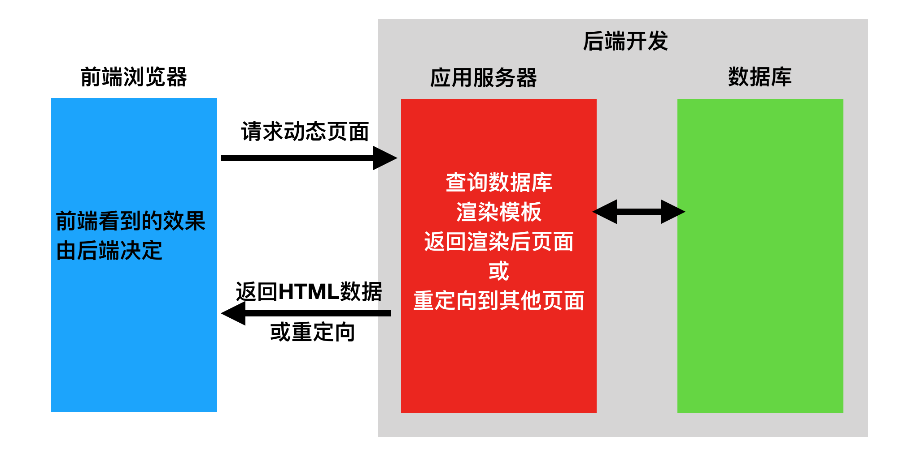
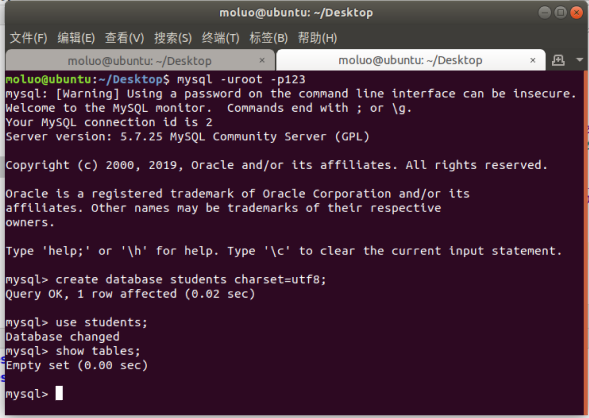
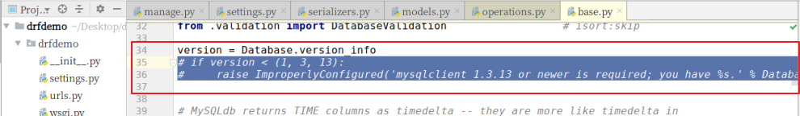
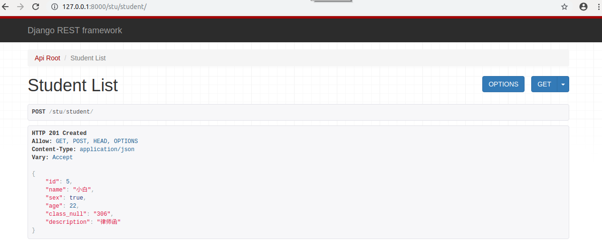
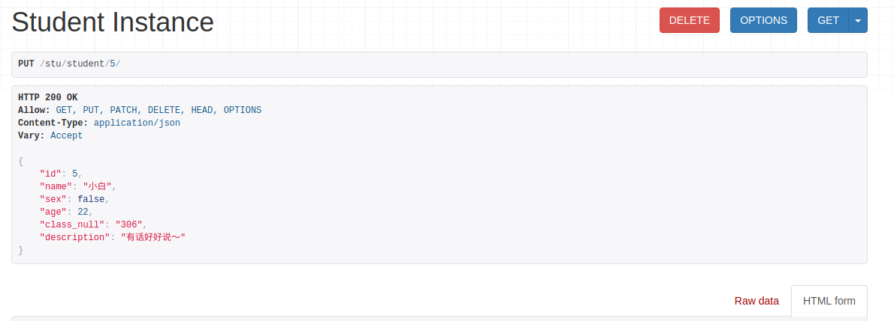
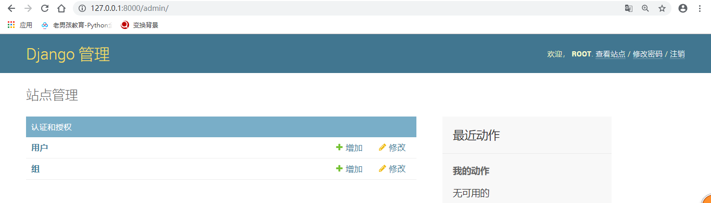

#  1. Web应用模式

在开发Web应用中，有两种应用模式：

1. 前后端不分离



2. 前后端分离


# 2. api接口

为了在团队内部形成共识、防止个人习惯差异引起的混乱，我们需要找到一种大家都觉得很好的接口实现规范，而且这种规范能够让后端写的接口，用途一目了然，减少双方之间的合作成本。

目前市面上大部分公司开发人员使用的接口服务架构主要有：restful、rpc。


rpc: 翻译成中文:远程过程调用[远程服务调用].

http://www.lufei.com/api

post请求

action=get_all_student&params=301&sex=1


接口多了,对应函数名和参数就多了,前端在请求api接口时,就会比较难找.容易出现重复的接口


restful: 翻译成中文: 资源状态转换.

把后端所有的数据/文件都看成资源. 

那么接口请求数据,本质上来说就是对资源的操作了.

web项目中操作资源,无非就是增删查改.所以要求在地址栏中声明要操作的资源是什么,然后通过http请求动词来说明对资源进行哪一种操作.

POST http://www.lufei.com/api/students/   添加学生数据

GET    http://www.lufei.com/api/students/   获取所有学生

DELETE http://www.lufei.com/api/students/<pk>   删除1个学生 


# 3. RESTful API规范


REST全称是Representational State Transfer，中文意思是表述（编者注：通常译为表征）性状态转移。 它首次出现在2000年Roy Fielding的博士论文中。

RESTful是一种定义Web API接口的设计风格，尤其适用于前后端分离的应用模式中。

这种风格的理念认为后端开发任务就是提供数据的，对外提供的是数据资源的访问接口，所以在定义接口时，客户端访问的URL路径就表示这种要操作的数据资源。

而对于数据资源分别使用POST、DELETE、GET、UPDATE等请求动作来表达对数据的增删查改。

| 请求方法 | 请求地址       | 后端操作           |
| -------- | -------------- | ------------------ |
| GET      | /students      | 获取所有学生       |
| POST     | /students      | 增加学生           |
| GET      | /students/<pk> | 获取编号为pk的学生 |
| PUT      | /students/<pk> | 修改编号为pk的学生 |
| DELETE   | /students/<pk> | 删除编号为pk的学生 |


事实上，我们可以使用任何一个框架都可以实现符合restful规范的API接口。

参考文档：http://www.runoob.com/w3cnote/restful-architecture.html


# 4. 序列化

api接口开发，最核心最常见的一个过程就是序列化，所谓序列化就是把**数据转换格式**，序列化可以分两个阶段：

**序列化**： 把我们识别的数据转换成指定的格式提供给别人。

例如：我们在django中获取到的数据默认是模型对象，但是模型对象数据无法直接提供给前端或别的平台使用，所以我们需要把数据进行序列化，变成字符串或者json数据，提供给别人。

**反序列化**：把别人提供的数据转换/还原成我们需要的格式。

例如：前端js提供过来的json数据，对于python而言就是字符串，我们需要进行反序列化换成模型类对象，这样我们才能把数据保存到数据库中。


# 5. Django Rest_Framework

核心思想: 缩减编写api接口的代码

Django REST framework是一个建立在Django基础之上的Web 应用开发框架，可以快速的开发REST API接口应用。在REST framework中，提供了序列化器Serialzier的定义，可以帮助我们简化序列化与反序列化的过程，不仅如此，还提供丰富的类视图、扩展类、视图集来简化视图的编写工作。REST framework还提供了认证、权限、限流、过滤、分页、接口文档等功能支持。REST framework提供了一个API 的Web可视化界面来方便查看测试接口。


中文文档：https://q1mi.github.io/Django-REST-framework-documentation/#django-rest-framework

github: https://github.com/encode/django-rest-framework/tree/master

### 特点

- 提供了定义序列化器Serializer的方法，可以快速根据 Django ORM 或者其它库自动序列化/反序列化；
- 提供了丰富的类视图、Mixin扩展类，简化视图的编写；
- 丰富的定制层级：函数视图、类视图、视图集合到自动生成 API，满足各种需要；
- 多种身份认证和权限认证方式的支持；[jwt]
- 内置了限流系统；
- 直观的 API web 界面；
- 可扩展性，插件丰富


# 6. 环境安装与配置

DRF需要以下依赖：

- Python (2.7, 3.2, 3.3, 3.4, 3.5, 3.6)
- Django (1.10, 1.11, 2.0)

**DRF是以Django扩展应用的方式提供的，所以我们可以直接利用已有的Django环境而无需从新创建。（若没有Django环境，需要先创建环境安装Django）**


## 6.1 安装DRF

前提是已经安装了django，建议安装在虚拟环境

```python
# mkvirtualenv drfdemo -p python3
# pip install django

pip install djangorestframework
pip install pymysql
```


linux 复制  shift+insert

### 6.1.1 创建django项目

```
cd ~/Desktop
django-admin startproject drfdemo
```


使用pycharm打开项目，设置虚拟环境的解析器，并修改manage.py中的后缀参数。


## 6.2 添加rest_framework应用

在**settings.py**的**INSTALLED_APPS**中添加'rest_framework'。

```python
INSTALLED_APPS = [
    ...
    'rest_framework',
]
```

接下来就可以使用DRF提供的功能进行api接口开发了。在项目中如果使用rest_framework框架实现API接口，主要有以下三个步骤：

- 将请求的数据（如JSON格式）转换为模型类对象
- 操作数据库
- 将模型类对象转换为响应的数据（如JSON格式）


接下来，我们快速体验下四天后我们学习完成drf以后的开发代码。接下来代码不需要理解，看步骤。

## 6.3 体验drf完全简写代码的过程

### 6.3.1. 创建模型操作类

```python
class Student(models.Model):
    # 模型字段
    name = models.CharField(max_length=100,verbose_name="姓名")
    sex = models.BooleanField(default=1,verbose_name="性别")
    age = models.IntegerField(verbose_name="年龄")
    class_null = models.CharField(max_length=5,verbose_name="班级编号")
    description = models.TextField(max_length=1000,verbose_name="个性签名")

    class Meta:
        db_table="tb_student"
        verbose_name = "学生"
        verbose_name_plural = verbose_name
```

为了方便测试，所以我们可以先创建一个数据库。

```
create database students charset=utf8;
```



#### 6.3.1.1 执行数据迁移

把students子应用添加到INSTALL_APPS中


初始化数据库连接

```
安装pymysql
pip install pymysql
```

主引用中`__init__.py`设置使用pymysql作为数据库驱动

```python
import pymysql

pymysql.install_as_MySQLdb()
```


settings.py配置文件中设置mysql的账号密码

```python
DATABASES = {
    # 'default': {
    #     'ENGINE': 'django.db.backends.sqlite3',
    #     'NAME': os.path.join(BASE_DIR, 'db.sqlite3'),
    # },
    'default': {
        'ENGINE': 'django.db.backends.mysql',
        'NAME': "students",
        "HOST": "127.0.0.1",
        "PORT": 3306,
        "USER": "root",
        "PASSWORD":"123",
    },
}
```


```python

```

终端下，执行数据迁移。

```
python manage.py makemigrations
python manage.py migrate
```

 

错误列表

```python
# 执行数据迁移 python manage.py makemigrations 报错如下：
```


解决方案：

```python
注释掉 backends/mysql/base.py中的35和36行代码。
```




```python
# 执行数据迁移发生以下错误：
```


解决方法：

backends/mysql/operations.py146行里面新增一个行代码：


### 6.3.2. 创建序列化器

例如，在django项目中创建学生子应用。

```python
python manage.py startapp students
```

在syudents应用目录中新建serializers.py用于保存该应用的序列化器。

创建一个StudentModelSerializer用于序列化与反序列化。

```python
# 创建序列化器类，回头会在试图中被调用
class StudentModelSerializer(serializers.ModelSerializer):
    class Meta:
        model = Student
        fields = "__all__"
```

- **model** 指明该序列化器处理的数据字段从模型类BookInfo参考生成
- **fields** 指明该序列化器包含模型类中的哪些字段，'__all__'指明包含所有字段


### 6.3.3. 编写视图

在students应用的views.py中创建视图StudentViewSet，这是一个视图集合。

```python
from rest_framework.viewsets import ModelViewSet
from .models import Student
from .serializers import StudentModelSerializer
# Create your views here.
class StudentViewSet(ModelViewSet):
    queryset = Student.objects.all()
    serializer_class = StudentModelSerializer
```

- **queryset** 指明该视图集在查询数据时使用的查询集
- **serializer_class** 指明该视图在进行序列化或反序列化时使用的序列化器

### 6.3.4. 定义路由

在students应用的urls.py中定义路由信息。

```python
from . import views
from rest_framework.routers import DefaultRouter

# 路由列表
urlpatterns = []

router = DefaultRouter()  # 可以处理视图的路由器
router.register('students', views.StudentViewSet)  # 向路由器中注册视图集

urlpatterns += router.urls  # 将路由器中的所以路由信息追到到django的路由列表中
```

最后把students子应用中的路由文件加载到总路由文件中.

```python
from django.contrib import admin
from django.urls import path,include

urlpatterns = [
    path('admin/', admin.site.urls),
    path("stu/",include("students.urls")),
]

```


### 6.3.5. 运行测试

运行当前程序（与运行Django一样）

```shell
python manage.py runserver
```

在浏览器中输入网址127.0.0.1:8000，可以看到DRF提供的API Web浏览页面：


1）点击链接127.0.0.1:8000/stu/students 可以访问**获取所有数据的接口**，呈现如下页面：


2）在页面底下表单部分填写学生信息，可以访问**添加新学生的接口**，保存学生信息：


点击POST后，返回如下页面信息：




3）在浏览器中输入网址127.0.0.1:8000/stu/students/5/，可以访问**获取单一学生信息的接口**（id为5的学生），呈现如下页面：


4）在页面底部表单中填写学生信息，可以访问**修改学生的接口**：


点击PUT，返回如下页面信息：



5）点击DELETE按钮，可以访问**删除学生的接口**：


返回，如下页面：


# 7. 序列化器-Serializer

作用：

    1. 序列化,序列化器会把模型对象转换成字典,经过response以后变成json字符串
    2. 反序列化,把客户端发送过来的数据,经过request以后变成字典,序列化器可以把字典转成模型
    3. 反序列化,完成数据校验功能


## 7.1 定义序列化器

Django REST framework中的Serializer使用类来定义，须继承自rest_framework.serializers.Serializer。

接下来，为了方便演示序列化器的使用，我们先创建一个新的子应用sers

```
python manage.py startapp sers
```


我们已有了一个数据库模型类students/Student

```python
from django.db import models

# Create your models here.
class Student(models.Model):
    # 模型字段
    name = models.CharField(max_length=100,verbose_name="姓名",help_text="提示文本:账号不能为空！")
    sex = models.BooleanField(default=True,verbose_name="性别")
    age = models.IntegerField(verbose_name="年龄")
    class_null = models.CharField(max_length=5,verbose_name="班级编号")
    description = models.TextField(verbose_name="个性签名")

    class Meta:
        db_table="tb_student"
        verbose_name = "学生"
        verbose_name_plural = verbose_name
```

我们想为这个模型类提供一个序列化器，可以定义如下：

```python
from rest_framework import serializers

# 声明序列化器，所有的序列化器都要直接或者间接继承于 Serializer
# 其中，ModelSerializer是Serializer的子类，ModelSerializer在Serializer的基础上进行了代码简化
class StudentSerializer(serializers.Serializer):
    """学生信息序列化器"""
    # 1. 需要进行数据转换的字段
    id = serializers.IntegerField()
    name = serializers.CharField()
    age = serializers.IntegerField()
    sex = serializers.BooleanField()
    description = serializers.CharField()

    # 2. 如果序列化器集成的是ModelSerializer，则需要声明调用的模型信息

    # 3. 验证代码

    # 4. 编写添加和更新模型的代码
```

**注意：serializer不是只能为数据库模型类定义，也可以为非数据库模型类的数据定义。**serializer是独立于数据库之外的存在。


**常用字段类型**：

| 字段                    | 字段构造方式                                                 |
| ----------------------- | ------------------------------------------------------------ |
| **BooleanField**        | BooleanField()                                               |
| **NullBooleanField**    | NullBooleanField()                                           |
| **CharField**           | CharField(max_length=None, min_length=None, allow_blank=False, trim_whitespace=True) |
| **EmailField**          | EmailField(max_length=None, min_length=None, allow_blank=False) |
| **RegexField**          | RegexField(regex, max_length=None, min_length=None, allow_blank=False) |
| **SlugField**           | SlugField(max*length=50, min_length=None, allow_blank=False) 正则字段，验证正则模式 [a-zA-Z0-9*-]+ |
| **URLField**            | URLField(max_length=200, min_length=None, allow_blank=False) |
| **UUIDField**           | UUIDField(format='hex_verbose')  format:  1) `'hex_verbose'` 如`"5ce0e9a5-5ffa-654b-cee0-1238041fb31a"`  2） `'hex'` 如 `"5ce0e9a55ffa654bcee01238041fb31a"`  3）`'int'` - 如: `"123456789012312313134124512351145145114"`  4）`'urn'` 如: `"urn:uuid:5ce0e9a5-5ffa-654b-cee0-1238041fb31a"` |
| **IPAddressField**      | IPAddressField(protocol='both', unpack_ipv4=False, **options) |
| **IntegerField**        | IntegerField(max_value=None, min_value=None)                 |
| **FloatField**          | FloatField(max_value=None, min_value=None)                   |
| **DecimalField**        | DecimalField(max_digits, decimal_places, coerce_to_string=None, max_value=None, min_value=None) max_digits: 最多位数 decimal_palces: 小数点位置 |
| **DateTimeField**       | DateTimeField(format=api_settings.DATETIME_FORMAT, input_formats=None) |
| **DateField**           | DateField(format=api_settings.DATE_FORMAT, input_formats=None) |
| **TimeField**           | TimeField(format=api_settings.TIME_FORMAT, input_formats=None) |
| **DurationField**       | DurationField()                                              |
| **ChoiceField**         | ChoiceField(choices) choices与Django的用法相同               |
| **MultipleChoiceField** | MultipleChoiceField(choices)                                 |
| **FileField**           | FileField(max_length=None, allow_empty_file=False, use_url=UPLOADED_FILES_USE_URL) |
| **ImageField**          | ImageField(max_length=None, allow_empty_file=False, use_url=UPLOADED_FILES_USE_URL) |
| **ListField**           | ListField(child=, min_length=None, max_length=None)          |
| **DictField**           | DictField(child=)                                            |

**选项参数：**

| 参数名称            | 作用             |
| ------------------- | ---------------- |
| **max_length**      | 最大长度         |
| **min_lenght**      | 最小长度         |
| **allow_blank**     | 是否允许为空     |
| **trim_whitespace** | 是否截断空白字符 |
| **max_value**       | 最小值           |
| **min_value**       | 最大值           |

通用参数：

| 参数名称           | 说明                                          |
| ------------------ | --------------------------------------------- |
| **read_only**      | 表明该字段仅用于序列化输出，默认False         |
| **write_only**     | 表明该字段仅用于反序列化输入，默认False       |
| **required**       | 表明该字段在反序列化时必须输入，默认True      |
| **default**        | 反序列化时使用的默认值                        |
| **allow_null**     | 表明该字段是否允许传入None，默认False         |
| **validators**     | 该字段使用的验证器                            |
| **error_messages** | 包含错误编号与错误信息的字典                  |
| **label**          | 用于HTML展示API页面时，显示的字段名称         |
| **help_text**      | 用于HTML展示API页面时，显示的字段帮助提示信息 |


## 7.2 创建Serializer对象

定义好Serializer类后，就可以创建Serializer对象了。

Serializer的构造方法为：

```python
Serializer(instance=None, data=empty, **kwarg)
```

说明：

1）用于序列化时，将模型类对象传入**instance**参数

2）用于反序列化时，将要被反序列化的数据传入**data**参数

3）除了instance和data参数外，在构造Serializer对象时，还可通过**context**参数额外添加数据，如

```python
serializer = AccountSerializer(account, context={'request': request})
```

**通过context参数附加的数据，可以通过Serializer对象的context属性获取。**


1. 使用序列化器的时候一定要注意，序列化器声明了以后，不会自动执行，需要我们在视图中进行调用才可以。
2. 序列化器无法直接接收数据，需要我们在视图中创建序列化器对象时把使用的数据传递过来。
3. 序列化器的字段声明类似于我们前面使用过的表单系统。
4. 开发restful api时，序列化器会帮我们把模型数据转换成字典.
5. drf提供的视图会帮我们把字典转换成json,或者把客户端发送过来的数据转换字典.


## 7.3 序列化器的使用

序列化器的使用分两个阶段：

1. 在客户端请求时，使用序列化器可以完成对数据的反序列化。
2. 在服务器响应时，使用序列化器可以完成对数据的序列化。


### 7.3.1 序列化

#### 7.3.1.1 基本使用

1） 先查询出一个学生对象

```python
from students.models import Student

student = Student.objects.get(id=3)
```

2） 构造序列化器对象

```python
from .serializers import StudentSerializer

serializer = StudentSerializer(instance=student)
```

3）获取序列化数据

通过data属性可以获取序列化后的数据

```python
serializer.data
# {'id': 4, 'name': '小张', 'age': 18, 'sex': True, 'description': '猴赛雷'}
```

完整视图代码：

```python
from django.views import View
from students.models import Student
from .serializers import StudentSerializer
from django.http.response import JsonResponse
class StudentView(View):
    """使用序列化器序列化转换单个模型数据"""
    def get(self,request,pk):
        # 获取数据
        student = Student.objects.get(pk=pk)
        # 数据转换[序列化过程]
        serializer = StudentSerializer(instance=student)
        print(serializer.data)
        # 响应数据
        return JsonResponse(serializer.data)
```


4）如果要被序列化的是包含多条数据的查询集QuerySet，可以通过添加**many=True**参数补充说明

```python
    """使用序列化器序列化转换多个模型数据"""
    def get(self,request):
        # 获取数据
        student_list = Student.objects.all()

        # 转换数据[序列化过程]
        # 如果转换多个模型对象数据，则需要加上many=True
        serializer = StudentSerializer(instance=student_list,many=True)
        print( serializer.data ) # 序列化器转换后的数据

        # 响应数据给客户端
        # 返回的json数据，如果是列表，则需要声明safe=False
        return JsonResponse(serializer.data,safe=False)
    
    
    # 访问结果：
    # [OrderedDict([('id', 1), ('name', 'xiaoming'), ('age', 20), ('sex', True), ('description', '测试')]), OrderedDict([('id', 2), ('name', 'xiaohui'), ('age', 22), ('sex', True), ('description', '后面来的测试')]), OrderedDict([('id', 4), ('name', '小张'), ('age', 18), ('sex', True), ('description', '猴赛雷')])]

```


### 7.3.2  反序列化

#### 7.3.2.1 数据验证

使用序列化器进行反序列化时，需要对数据进行验证后，才能获取验证成功的数据或保存成模型类对象。

在获取反序列化的数据前，必须调用**is_valid()**方法进行验证，验证成功返回True，否则返回False。

验证失败，可以通过序列化器对象的**errors**属性获取错误信息，返回字典，包含了字段和字段的错误。如果是非字段错误，可以通过修改REST framework配置中的**NON_FIELD_ERRORS_KEY**来控制错误字典中的键名。

验证成功，可以通过序列化器对象的**validated_data**属性获取数据。

在定义序列化器时，指明每个字段的序列化类型和选项参数，本身就是一种验证行为。

如我们前面定义过的BookInfoSerializer

```python
class BookInfoSerializer(serializers.Serializer):
    """图书数据序列化器"""
    id = serializers.IntegerField(label='ID', read_only=True)
    btitle = serializers.CharField(label='名称', max_length=20)
    bpub_date = serializers.DateField(label='发布日期', required=False)
    bread = serializers.IntegerField(label='阅读量', required=False)
    bcomment = serializers.IntegerField(label='评论量', required=False)
    image = serializers.ImageField(label='图片', required=False)
```

通过构造序列化器对象，并将要反序列化的数据传递给data构造参数，进而进行验证

```python
from booktest.serializers import BookInfoSerializer
data = {'bpub_date': 123}
serializer = BookInfoSerializer(data=data)
serializer.is_valid()  # 返回False
serializer.errors
# {'btitle': [ErrorDetail(string='This field is required.', code='required')], 'bpub_date': [ErrorDetail(string='Date has wrong format. Use one of these formats instead: YYYY[-MM[-DD]].', code='invalid')]}
serializer.validated_data  # {}

data = {'btitle': 'python'}
serializer = BookInfoSerializer(data=data)
serializer.is_valid()  # True
serializer.errors  # {}
serializer.validated_data  #  OrderedDict([('btitle', 'python')])
```

is_valid()方法还可以在验证失败时抛出异常serializers.ValidationError，可以通过传递**raise_exception=True**参数开启，REST framework接收到此异常，会向前端返回HTTP 400 Bad Request响应。

```python
# Return a 400 response if the data was invalid.
serializer.is_valid(raise_exception=True)
```

如果觉得这些还不够，需要再补充定义验证行为，可以使用以下三种方法：

##### 1) validate_字段名

对`<field_name>`字段进行验证，如

```python
class BookInfoSerializer(serializers.Serializer):
    """图书数据序列化器"""
    ...

    def validate_btitle(self, value):
        if 'django' not in value.lower():
            raise serializers.ValidationError("图书不是关于Django的")
        return value
```

测试

```python
from booktest.serializers import BookInfoSerializer
data = {'btitle': 'python'}
serializer = BookInfoSerializer(data=data)
serializer.is_valid()  # False   
serializer.errors
#  {'btitle': [ErrorDetail(string='图书不是关于Django的', code='invalid')]}
```

##### 2) validate

在序列化器中需要同时对多个字段进行比较验证时，可以定义validate方法来验证，如

```python
class BookInfoSerializer(serializers.Serializer):
    """图书数据序列化器"""
    ...

    def validate(self, attrs):
        bread = attrs['bread']
        bcomment = attrs['bcomment']
        if bread < bcomment:
            raise serializers.ValidationError('阅读量小于评论量')
        return attrs
```

测试

```python
from booktest.serializers import BookInfoSerializer
data = {'btitle': 'about django', 'bread': 10, 'bcomment': 20}
s = BookInfoSerializer(data=data)
s.is_valid()  # False
s.errors
#  {'non_field_errors': [ErrorDetail(string='阅读量小于评论量', code='invalid')]}
```

##### 3) validators

在字段中添加validators选项参数，也可以补充验证行为，如

```python
def about_django(value):
    if 'django' not in value.lower():
        raise serializers.ValidationError("图书不是关于Django的")

class BookInfoSerializer(serializers.Serializer):
    """图书数据序列化器"""
    id = serializers.IntegerField(label='ID', read_only=True)
    btitle = serializers.CharField(label='名称', max_length=20, validators=[about_django])
    bpub_date = serializers.DateField(label='发布日期', required=False)
    bread = serializers.IntegerField(label='阅读量', required=False)
    bcomment = serializers.IntegerField(label='评论量', required=False)
    image = serializers.ImageField(label='图片', required=False)
```

测试：

```python
from booktest.serializers import BookInfoSerializer
data = {'btitle': 'python'}
serializer = BookInfoSerializer(data=data)
serializer.is_valid()  # False   
serializer.errors
#  {'btitle': [ErrorDetail(string='图书不是关于Django的', code='invalid')]}
```


#### 7.3.2.2  反序列化-保存数据

前面的验证数据成功后,我们可以使用序列化器来完成数据反序列化的过程.这个过程可以把数据转成模型类对象.

可以通过实现create()和update()两个方法来实现。

```python
class BookInfoSerializer(serializers.Serializer):
    """图书数据序列化器"""
    ...

    def create(self, validated_data):
        """新建"""
        return BookInfo(**validated_data)

    def update(self, instance, validated_data):
        """更新，instance为要更新的对象实例"""
        instance.btitle = validated_data.get('btitle', instance.btitle)
        instance.bpub_date = validated_data.get('bpub_date', instance.bpub_date)
        instance.bread = validated_data.get('bread', instance.bread)
        instance.bcomment = validated_data.get('bcomment', instance.bcomment)
        return instance
```

如果需要在返回数据对象的时候，也将数据保存到数据库中，则可以进行如下修改

```python
class BookInfoSerializer(serializers.Serializer):
    """图书数据序列化器"""
    ...

    def create(self, validated_data):
        """新建"""
        return BookInfo.objects.create(**validated_data)

    def update(self, instance, validated_data):
        """更新，instance为要更新的对象实例"""
        instance.btitle = validated_data.get('btitle', instance.btitle)
        instance.bpub_date = validated_data.get('bpub_date', instance.bpub_date)
        instance.bread = validated_data.get('bread', instance.bread)
        instance.bcomment = validated_data.get('bcomment', instance.bcomment)
        instance.save()
        return instance
```

实现了上述两个方法后，在反序列化数据的时候，就可以通过save()方法返回一个数据对象实例了

```python
book = serializer.save()
```

如果创建序列化器对象的时候，没有传递instance实例，则调用save()方法的时候，create()被调用，相反，如果传递了instance实例，则调用save()方法的时候，update()被调用。

```python
from db.serializers import BookInfoSerializer
data = {'btitle': '封神演义'}
serializer = BookInfoSerializer(data=data)
serializer.is_valid()  # True
serializer.save()  # <BookInfo: 封神演义>

from db.models import BookInfo
book = BookInfo.objects.get(id=2)
data = {'btitle': '倚天剑'}
serializer = BookInfoSerializer(book, data=data)
serializer.is_valid()  # True
serializer.save()  # <BookInfo: 倚天剑>
book.btitle  # '倚天剑'
```


#### 7.3.2.3 附加说明

1） 在对序列化器进行save()保存时，可以额外传递数据，这些数据可以在create()和update()中的validated_data参数获取到

```python
# request.user 是django中记录当前登录用户的模型对象
serializer.save(owner=request.user)
```

2）默认序列化器必须传递所有required的字段，否则会抛出验证异常。但是我们可以使用partial参数来允许部分字段更新

```python
# Update `comment` with partial data
serializer = CommentSerializer(comment, data={'content': u'foo bar'}, partial=True)
```


### 7.3.3 模型类序列化器

如果我们想要使用序列化器对应的是Django的模型类，DRF为我们提供了ModelSerializer模型类序列化器来帮助我们快速创建一个Serializer类。

ModelSerializer与常规的Serializer相同，但提供了：

- 基于模型类自动生成一系列字段
- 基于模型类自动为Serializer生成validators，比如unique_together
- 包含默认的create()和update()的实现

#### 7.3.3.1 定义

比如我们创建一个BookInfoSerializer

```python
class BookInfoSerializer(serializers.ModelSerializer):
    """图书数据序列化器"""
    class Meta:
        model = BookInfo
        fields = '__all__'
```

- model 指明参照哪个模型类
- fields 指明为模型类的哪些字段生成

我们可以在python manage.py shell中查看自动生成的BookInfoSerializer的具体实现

```python
>>> from booktest.serializers import BookInfoSerializer
>>> serializer = BookInfoSerializer()
>>> serializer
BookInfoSerializer():
    id = IntegerField(label='ID', read_only=True)
    btitle = CharField(label='名称', max_length=20)
    bpub_date = DateField(allow_null=True, label='发布日期', required=False)
    bread = IntegerField(label='阅读量', max_value=2147483647, min_value=-2147483648, required=False)
    bcomment = IntegerField(label='评论量', max_value=2147483647, min_value=-2147483648, required=False)
    image = ImageField(allow_null=True, label='图片', max_length=100, required=False)
```

#### 7.3.3.2 指定字段

1) 使用**fields**来明确字段，`__all__`表名包含所有字段，也可以写明具体哪些字段，如

```python
class BookInfoSerializer(serializers.ModelSerializer):
    """图书数据序列化器"""
    class Meta:
        model = BookInfo
        fields = ('id', 'btitle', 'bpub_date')
```

2) 使用**exclude**可以明确排除掉哪些字段

```python
class BookInfoSerializer(serializers.ModelSerializer):
    """图书数据序列化器"""
    class Meta:
        model = BookInfo
        exclude = ('image',)
```

3) 显示指明字段，如：

```python
class HeroInfoSerializer(serializers.ModelSerializer):
    hbook = BookInfoSerializer()

    class Meta:
        model = HeroInfo
        fields = ('id', 'hname', 'hgender', 'hcomment', 'hbook')
```

4) 指明只读字段

可以通过**read_only_fields**指明只读字段，即仅用于序列化输出的字段

```python
class BookInfoSerializer(serializers.ModelSerializer):
    """图书数据序列化器"""
    class Meta:
        model = BookInfo
        fields = ('id', 'btitle', 'bpub_date'， 'bread', 'bcomment')
        read_only_fields = ('id', 'bread', 'bcomment')
```


#### 7.3.3.3 添加额外参数

我们可以使用**extra_kwargs**参数为ModelSerializer添加或修改原有的选项参数

```python
class BookInfoSerializer(serializers.ModelSerializer):
    """图书数据序列化器"""
    class Meta:
        model = BookInfo
        fields = ('id', 'btitle', 'bpub_date', 'bread', 'bcomment')
        extra_kwargs = {
            'bread': {'min_value': 0, 'required': True},
            'bcomment': {'min_value': 0, 'required': True},
        }

# BookInfoSerializer():
#    id = IntegerField(label='ID', read_only=True)
#    btitle = CharField(label='名称', max_length=20)
#    bpub_date = DateField(allow_null=True, label='发布日期', required=False)
#    bread = IntegerField(label='阅读量', max_value=2147483647, min_value=0, required=True)
#    bcomment = IntegerField(label='评论量', max_value=2147483647, min_value=0, required=True)
```

什么时候声明的序列化器需要继承序列化器基类Serializer，什么时候继承模型序列化器类ModelSerializer？

```
继承序列化器类Serializer
	字段声明
	验证
	添加/保存数据功能
继承模型序列化器类ModelSerializer
	字段声明[可选,看需要]
	Meta声明
	验证
	添加/保存数据功能[可选]
```


看表字段大小，看使用哪个更加节省代码了。


# 8. 视图相关

drf除了在数据序列化部分简写代码以外，还在视图中提供了简写操作。所以在django原有的django.views.View类基础上，drf封装了多个子类出来提供给我们使用。

Django REST framwork 提供的视图的主要作用：

- 控制序列化器的执行（检验、保存、转换数据）
- 控制数据库查询的执行
- 调用请求类和响应类[这两个类也是由drf帮我们再次扩展了一些功能类。]


为了方便我们学习，所以先创建一个子应用req

```python
python manage.py startapp req
```


## 1. 请求与响应

### 1.1 Request

REST framework 传入视图的request对象不再是Django默认的HttpRequest对象，而是REST framework提供的扩展了HttpRequest类的**Request**类的对象。

REST framework 提供了**Parser**解析器，在接收到请求后会自动根据Content-Type指明的请求数据类型（如JSON、表单等）将请求数据进行parse解析，解析为类字典[QueryDict]对象保存到**Request**对象中。

**Request对象的数据是自动根据前端发送数据的格式进行解析之后的结果。**

无论前端发送的哪种格式的数据，我们都可以以统一的方式读取数据。

#### 1.1.1 常用属性

##### 1）.data

`request.data` 返回解析之后的请求体数据。类似于Django中标准的`request.POST`和 `request.FILES`属性，但提供如下特性：

- 包含了解析之后的文件和非文件数据
- 包含了对POST、PUT、PATCH请求方式解析后的数据
- 利用了REST framework的parsers解析器，不仅支持表单类型数据，也支持JSON数据

##### 2）.query_params

`request.query_params`与Django标准的`request.GET`相同，只是更换了更正确的名称而已。


### 1.2 Response

```
rest_framework.response.Response
```

REST framework提供了一个响应类`Response`，使用该类构造响应对象时，响应的具体数据内容会被转换（render渲染）成符合前端需求的类型。

REST framework提供了`Renderer` 渲染器，用来根据请求头中的`Accept`（接收数据类型声明）来自动转换响应数据到对应格式。如果前端请求中未进行Accept声明，则会采用默认方式处理响应数据，我们可以通过配置来修改默认响应格式。

可以在**rest_framework.settings**查找所有的drf默认配置项

```python
REST_FRAMEWORK = {
    'DEFAULT_RENDERER_CLASSES': (  # 默认响应渲染类
        'rest_framework.renderers.JSONRenderer',  # json渲染器
        'rest_framework.renderers.BrowsableAPIRenderer',  # 浏览API渲染器
    )
}
```

#### 1.2.1 构造方式

```python
Response(data, status=None, template_name=None, headers=None, content_type=None)
```

`data`数据不要是render处理之后的数据，只需传递python的内建类型数据即可，REST framework会使用`renderer`渲染器处理`data`。

`data`不能是复杂结构的数据，如Django的模型类对象，对于这样的数据我们可以使用`Serializer`序列化器序列化处理后（转为了Python字典类型）再传递给`data`参数。

参数说明：

- `data`: 为响应准备的序列化处理后的数据；
- `status`: 状态码，默认200；
- `template_name`: 模板名称，如果使用`HTMLRenderer` 时需指明；
- `headers`: 用于存放响应头信息的字典；
- `content_type`: 响应数据的Content-Type，通常此参数无需传递，REST framework会根据前端所需类型数据来设置该参数。

#### 1.2.2 常用属性

##### 1）.data

传给response对象的序列化后，但尚未render处理的数据

##### 2）.status_code

状态码的数字

##### 3）.content

经过render处理后的响应数据


#### 1.2.3 状态码

为了方便设置状态码，REST framewrok在`rest_framework.status`模块中提供了常用状态码常量。

##### 1）信息告知 - 1xx

```python
HTTP_100_CONTINUE
HTTP_101_SWITCHING_PROTOCOLS
```

##### 2）成功 - 2xx

```python
HTTP_200_OK
HTTP_201_CREATED
HTTP_202_ACCEPTED
HTTP_203_NON_AUTHORITATIVE_INFORMATION
HTTP_204_NO_CONTENT
HTTP_205_RESET_CONTENT
HTTP_206_PARTIAL_CONTENT
HTTP_207_MULTI_STATUS
```

##### 3）重定向 - 3xx

```python
HTTP_300_MULTIPLE_CHOICES
HTTP_301_MOVED_PERMANENTLY
HTTP_302_FOUND
HTTP_303_SEE_OTHER
HTTP_304_NOT_MODIFIED
HTTP_305_USE_PROXY
HTTP_306_RESERVED
HTTP_307_TEMPORARY_REDIRECT
```

##### 4）客户端错误 - 4xx

```python
HTTP_400_BAD_REQUEST
HTTP_401_UNAUTHORIZED
HTTP_402_PAYMENT_REQUIRED
HTTP_403_FORBIDDEN
HTTP_404_NOT_FOUND
HTTP_405_METHOD_NOT_ALLOWED
HTTP_406_NOT_ACCEPTABLE
HTTP_407_PROXY_AUTHENTICATION_REQUIRED
HTTP_408_REQUEST_TIMEOUT
HTTP_409_CONFLICT
HTTP_410_GONE
HTTP_411_LENGTH_REQUIRED
HTTP_412_PRECONDITION_FAILED
HTTP_413_REQUEST_ENTITY_TOO_LARGE
HTTP_414_REQUEST_URI_TOO_LONG
HTTP_415_UNSUPPORTED_MEDIA_TYPE
HTTP_416_REQUESTED_RANGE_NOT_SATISFIABLE
HTTP_417_EXPECTATION_FAILED
HTTP_422_UNPROCESSABLE_ENTITY
HTTP_423_LOCKED
HTTP_424_FAILED_DEPENDENCY
HTTP_428_PRECONDITION_REQUIRED
HTTP_429_TOO_MANY_REQUESTS
HTTP_431_REQUEST_HEADER_FIELDS_TOO_LARGE
HTTP_451_UNAVAILABLE_FOR_LEGAL_REASONS
```

##### 5）服务器错误 - 5xx

```python
HTTP_500_INTERNAL_SERVER_ERROR
HTTP_501_NOT_IMPLEMENTED
HTTP_502_BAD_GATEWAY
HTTP_503_SERVICE_UNAVAILABLE
HTTP_504_GATEWAY_TIMEOUT
HTTP_505_HTTP_VERSION_NOT_SUPPORTED
HTTP_507_INSUFFICIENT_STORAGE
HTTP_511_NETWORK_AUTHENTICATION_REQUIRED
```


## 2 视图

REST framework 提供了众多的通用视图基类与扩展类，以简化视图的编写。


### 2.1 2个视图基类

#### 2.1.1 APIView

```
rest_framework.views.APIView
```

`APIView`是REST framework提供的所有视图的基类，继承自Django的`View`父类。

`APIView`与`View`的不同之处在于：

- 传入到视图方法中的是REST framework的`Request`对象，而不是Django的`HttpRequeset`对象；
- 视图方法可以返回REST framework的`Response`对象，视图会为响应数据设置（render）符合前端要求的格式；
- 任何`APIException`异常都会被捕获到，并且处理成合适的响应信息；
- 在进行dispatch()分发前，会对请求进行身份认证、权限检查、流量控制。

支持定义的类属性

- **authentication_classes** 列表或元祖，身份认证类
- **permissoin_classes** 列表或元祖，权限检查类
- **throttle_classes** 列表或元祖，流量控制类

在`APIView`中仍以常规的类视图定义方法来实现get() 、post() 或者其他请求方式的方法。

举例：

```python
from rest_framework.views import APIView
from rest_framework.response import Response

# url(r'^students/$', views.StudentsAPIView.as_view()),
class StudentsAPIView(APIView):
  	
    def get(self, request):
        data_list = Student.objects.all()
        serializer = StudentModelSerializer(instance=data_list, many=True)
        return Response(serializer.data)
```

#### 2.1.2 GenericAPIView[通用视图类]

```
rest_framework.generics.GenericAPIView
```

继承自`APIVIew`，**主要增加了操作序列化器和数据库查询的方法，作用是为下面Mixin扩展类的执行提供方法支持。通常在使用时，可搭配一个或多个Mixin扩展类。**

提供的关于序列化器使用的属性与方法

- 属性：

    - **serializer_class** 指明视图使用的序列化器

- 方法：

    - **get_serializer_class(self)**

        当出现一个视图类中调用多个序列化器时,那么可以通过条件判断在get_serializer_class方法中通过返回不同的序列化器类名就可以让视图方法执行不同的序列化器对象了。

        返回序列化器类，默认返回`serializer_class`，可以重写，例如：

        ```python
        def get_serializer_class(self):
            if self.request.user.is_staff:
                return FullAccountSerializer
            return BasicAccountSerializer
        ```

    - ##### get_serializer(self, *args, \**kwargs)

        返回序列化器对象，主要用来提供给Mixin扩展类使用，如果我们在视图中想要获取序列化器对象，也可以直接调用此方法。

        **注意，该方法在提供序列化器对象的时候，会向序列化器对象的context属性补充三个数据：request、format、view，这三个数据对象可以在定义序列化器时使用。**

        - **request** 当前视图的请求对象
        - **view** 当前请求的类视图对象
        - format 当前请求期望返回的数据格式

提供的关于数据库查询的属性与方法

- 属性：

    - **queryset** 指明使用的数据查询集

- 方法：

    - **get_queryset(self)**

        返回视图使用的查询集，主要用来提供给Mixin扩展类使用，是列表视图与详情视图获取数据的基础，默认返回`queryset`属性，可以重写，例如：

        ```python
        def get_queryset(self):
            user = self.request.user
            return user.accounts.all()
        ```

    - **get_object(self)**

        返回详情视图所需的模型类数据对象，主要用来提供给Mixin扩展类使用。

        在试图中可以调用该方法获取详情信息的模型类对象。

        **若详情访问的模型类对象不存在，会返回404。**

        该方法会默认使用APIView提供的check_object_permissions方法检查当前对象是否有权限被访问。

        举例：

        ```python
        # url(r'^books/(?P<pk>\d+)/$', views.BookDetailView.as_view()),
        class BookDetailView(GenericAPIView):
            queryset = BookInfo.objects.all()
            serializer_class = BookInfoSerializer
        
            def get(self, request, pk):
                book = self.get_object() # get_object()方法根据pk参数查找queryset中的数据对象
                serializer = self.get_serializer(book)
                return Response(serializer.data)
        ```

其他可以设置的属性

- **pagination_class** 指明分页控制类
- **filter_backends** 指明过滤控制后端

为了方便学习上面的GenericAPIView通用视图类，我们新建一个子应用。

```python
python manage.py startapp gen
```

代码：

```python
from rest_framework.generics import GenericAPIView

from students.models import Student
from .serializers import StudentModelSerializer, StudentModel2Serializer
from rest_framework.response import Response

class StudentsGenericAPIView(GenericAPIView):
    # 本次视图类中要操作的数据[必填]
    queryset = Student.objects.all()
    # 本次视图类中要调用的默认序列化器[玄天]
    serializer_class = StudentModelSerializer

    def get(self, request):
        """获取所有学生信息"""
        serializer = self.get_serializer(instance=self.get_queryset(), many=True)

        return Response(serializer.data)

    def post(self,request):

        data = request.data

        serializer = self.get_serializer(data=data)

        serializer.is_valid(raise_exception=True)

        instance = serializer.save()

        serializer = self.get_serializer(instance=instance)

        return Response(serializer.data)


class StudentGenericAPIView(GenericAPIView):
    queryset = Student.objects.all()

    serializer_class = StudentModelSerializer

    def get_serializer_class(self):
        """重写获取序列化器类的方法"""
        if self.request.method == "GET":
            return StudentModel2Serializer
        else:
            return StudentModelSerializer

    # 在使用GenericAPIView视图获取或操作单个数据时,视图方法中的代表主键的参数最好是pk
    def get(self,request,pk):
        """获取一条数据"""
        serializer = self.get_serializer(instance=self.get_object())

        return Response(serializer.data)

    def put(self,request,pk):

        data = request.data

        serializer = self.get_serializer(instance=self.get_object(),data=data)

        serializer.is_valid(raise_exception=True)

        serializer.save()

        serializer = self.get_serializer(instance=self.get_object())

        return Response(serializer.data)

```

序列化器类：

```python
from rest_framework import serializers

from students.models import Student

class StudentModelSerializer(serializers.ModelSerializer):
    class Meta:
        model= Student
        fields = "__all__"


class StudentModel2Serializer(serializers.ModelSerializer):
    class Meta:
        model= Student
        fields = ("name","class_null")

```


### 2.2 5个视图扩展类

作用：

提供了几种后端视图（对数据资源进行曾删改查）处理流程的实现，如果需要编写的视图属于这五种，则视图可以通过继承相应的扩展类来复用代码，减少自己编写的代码量。

这五个扩展类需要搭配GenericAPIView父类，因为五个扩展类的实现需要调用GenericAPIView提供的序列化器与数据库查询的方法。


#### 1）ListModelMixin

列表视图扩展类，提供`list(request, *args, **kwargs)`方法快速实现列表视图，返回200状态码。

该Mixin的list方法会对数据进行过滤和分页。

源代码：

```python
class ListModelMixin(object):
    """
    List a queryset.
    """
    def list(self, request, *args, **kwargs):
        # 过滤
        queryset = self.filter_queryset(self.get_queryset())
        # 分页
        page = self.paginate_queryset(queryset)
        if page is not None:
            serializer = self.get_serializer(page, many=True)
            return self.get_paginated_response(serializer.data)
        # 序列化
        serializer = self.get_serializer(queryset, many=True)
        return Response(serializer.data)

```

举例：

```python
from rest_framework.mixins import ListModelMixin

class BookListView(ListModelMixin, GenericAPIView):
    queryset = BookInfo.objects.all()
    serializer_class = BookInfoSerializer

    def get(self, request):
        return self.list(request)

```


#### 2）CreateModelMixin

创建视图扩展类，提供`create(request, *args, **kwargs)`方法快速实现创建资源的视图，成功返回201状态码。

如果序列化器对前端发送的数据验证失败，返回400错误。

源代码：

```python
class CreateModelMixin(object):
    """
    Create a model instance.
    """
    def create(self, request, *args, **kwargs):
        # 获取序列化器
        serializer = self.get_serializer(data=request.data)
        # 验证
        serializer.is_valid(raise_exception=True)
        # 保存
        self.perform_create(serializer)
        headers = self.get_success_headers(serializer.data)
        return Response(serializer.data, status=status.HTTP_201_CREATED, headers=headers)

    def perform_create(self, serializer):
        serializer.save()

    def get_success_headers(self, data):
        try:
            return {'Location': str(data[api_settings.URL_FIELD_NAME])}
        except (TypeError, KeyError):
            return {}

```


#### 3）RetrieveModelMixin

详情视图扩展类，提供`retrieve(request, *args, **kwargs)`方法，可以快速实现返回一个存在的数据对象。

如果存在，返回200， 否则返回404。

源代码：

```python
class RetrieveModelMixin(object):
    """
    Retrieve a model instance.
    """
    def retrieve(self, request, *args, **kwargs):
        # 获取对象，会检查对象的权限
        instance = self.get_object()
        # 序列化
        serializer = self.get_serializer(instance)
        return Response(serializer.data)

```

举例：

```python
class BookDetailView(RetrieveModelMixin, GenericAPIView):
    queryset = BookInfo.objects.all()
    serializer_class = BookInfoSerializer

    def get(self, request, pk):
        return self.retrieve(request)

```


#### 4）UpdateModelMixin

更新视图扩展类，提供`update(request, *args, **kwargs)`方法，可以快速实现更新一个存在的数据对象。

同时也提供`partial_update(request, *args, **kwargs)`方法，可以实现局部更新。

成功返回200，序列化器校验数据失败时，返回400错误。

源代码：

```python
class UpdateModelMixin(object):
    """
    Update a model instance.
    """
    def update(self, request, *args, **kwargs):
        partial = kwargs.pop('partial', False)
        instance = self.get_object()
        serializer = self.get_serializer(instance, data=request.data, partial=partial)
        serializer.is_valid(raise_exception=True)
        self.perform_update(serializer)

        if getattr(instance, '_prefetched_objects_cache', None):
            # If 'prefetch_related' has been applied to a queryset, we need to
            # forcibly invalidate the prefetch cache on the instance.
            instance._prefetched_objects_cache = {}

        return Response(serializer.data)

    def perform_update(self, serializer):
        serializer.save()

    def partial_update(self, request, *args, **kwargs):
        kwargs['partial'] = True
        return self.update(request, *args, **kwargs)

```


#### 5）DestroyModelMixin

删除视图扩展类，提供`destroy(request, *args, **kwargs)`方法，可以快速实现删除一个存在的数据对象。

成功返回204，不存在返回404。

源代码：

```python
class DestroyModelMixin(object):
    """
    Destroy a model instance.
    """
    def destroy(self, request, *args, **kwargs):
        instance = self.get_object()
        self.perform_destroy(instance)
        return Response(status=status.HTTP_204_NO_CONTENT)

    def perform_destroy(self, instance):
        instance.delete()

```


使用GenericAPIView和视图扩展类，实现api接口，代码：

```python
"""GenericAPIView结合视图扩展类实现api接口"""
from rest_framework.mixins import ListModelMixin,CreateModelMixin
class Students2GenericAPIView(GenericAPIView,ListModelMixin,CreateModelMixin):
    # 本次视图类中要操作的数据[必填]
    queryset = Student.objects.all()
    # 本次视图类中要调用的默认序列化器[玄天]
    serializer_class = StudentModelSerializer

    def get(self, request):
        """获取多个学生信息"""
        return self.list(request)

    def post(self,request):
        """添加学生信息"""
        return self.create(request)


from rest_framework.mixins import RetrieveModelMixin,UpdateModelMixin,DestroyModelMixin
class Student2GenericAPIView(GenericAPIView,RetrieveModelMixin,UpdateModelMixin,DestroyModelMixin):
    queryset = Student.objects.all()

    serializer_class = StudentModelSerializer

    # 在使用GenericAPIView视图获取或操作单个数据时,视图方法中的代表主键的参数最好是pk
    def get(self,request,pk):
        """获取一条数据"""
        return self.retrieve(request,pk)

    def put(self,request,pk):
        """更新一条数据"""
        return self.update(request,pk)

    def delete(self,request,pk):
        """删除一条数据"""
        return self.destroy(request,pk)

```


### 2.3 GenericAPIView的视图子类

#### 1）CreateAPIView

提供 post 方法

继承自： GenericAPIView、CreateModelMixin

### 2）ListAPIView

提供 get 方法

继承自：GenericAPIView、ListModelMixin

#### 3）RetrieveAPIView

提供 get 方法

继承自: GenericAPIView、RetrieveModelMixin

#### 4）DestoryAPIView

提供 delete 方法

继承自：GenericAPIView、DestoryModelMixin

#### 5）UpdateAPIView

提供 put 和 patch 方法

继承自：GenericAPIView、UpdateModelMixin

#### 6）RetrieveUpdateAPIView

提供 get、put、patch方法

继承自： GenericAPIView、RetrieveModelMixin、UpdateModelMixin

#### 7）RetrieveUpdateDestoryAPIView

提供 get、put、patch、delete方法

继承自：GenericAPIView、RetrieveModelMixin、UpdateModelMixin、DestoryModelMixin


## 3 视图集ViewSet

使用视图集ViewSet，可以将一系列逻辑相关的动作放到一个类中：

- list() 提供一组数据
- retrieve() 提供单个数据
- create() 创建数据
- update() 保存数据
- destory() 删除数据

ViewSet视图集类不再实现get()、post()等方法，而是实现动作 **action** 如 list() 、create() 等。

视图集只在使用as_view()方法的时候，才会将**action**动作与具体请求方式对应上。如：

```python
class BookInfoViewSet(viewsets.ViewSet):

    def list(self, request):
        books = BookInfo.objects.all()
        serializer = BookInfoSerializer(books, many=True)
        return Response(serializer.data)

    def retrieve(self, request, pk=None):
        try:
            books = BookInfo.objects.get(id=pk)
        except BookInfo.DoesNotExist:
            return Response(status=status.HTTP_404_NOT_FOUND)
        serializer = BookInfoSerializer(books)
        return Response(serializer.data)

```

在设置路由时，我们可以如下操作

```python
urlpatterns = [
    url(r'^books/$', BookInfoViewSet.as_view({'get':'list'}),
    url(r'^books/(?P<pk>\d+)/$', BookInfoViewSet.as_view({'get': 'retrieve'})
]

```

### 3.1 常用视图集父类

#### 1） ViewSet

继承自`APIView`与`ViewSetMixin`，作用也与APIView基本类似，提供了身份认证、权限校验、流量管理等。

**ViewSet主要通过继承ViewSetMixin来实现在调用as_view()时传入字典（如{'get':'list'}）的映射处理工作。**

在ViewSet中，没有提供任何动作action方法，需要我们自己实现action方法。

#### 2）GenericViewSet

使用ViewSet通常并不方便，因为list、retrieve、create、update、destory等方法都需要自己编写，而这些方法与前面讲过的Mixin扩展类提供的方法同名，所以我们可以通过继承Mixin扩展类来复用这些方法而无需自己编写。但是Mixin扩展类依赖与`GenericAPIView`，所以还需要继承`GenericAPIView`。

**GenericViewSet**就帮助我们完成了这样的继承工作，继承自`GenericAPIView`与`ViewSetMixin`，在实现了调用as_view()时传入字典（如`{'get':'list'}`）的映射处理工作的同时，还提供了`GenericAPIView`提供的基础方法，可以直接搭配Mixin扩展类使用。

举例：

```python
from rest_framework.viewsets import GenericViewSet
from rest_framework.mixins import ListModelMixin,CreateModelMixin,RetrieveModelMixin,UpdateModelMixin,DestroyModelMixin
class Student4ViewSet(GenericViewSet,ListModelMixin,CreateModelMixin,RetrieveModelMixin,UpdateModelMixin,DestroyModelMixin):
    queryset = Student.objects.all()
    serializer_class = StudentModelSerializer

```

url的定义

```python
urlpatterns = [
    path("students7/", views.Student4ViewSet.as_view({"get": "list", "post": "create"})),
    re_path("students7/(?P<pk>\d+)/", views.Student4ViewSet.as_view({"get": "retrieve","put":"update","delete":"destroy"})),

]

```

#### 3）ModelViewSet

继承自`GenericViewSet`，同时包括了ListModelMixin、RetrieveModelMixin、CreateModelMixin、UpdateModelMixin、DestoryModelMixin。

#### 4）ReadOnlyModelViewSet

继承自`GenericViewSet`，同时包括了ListModelMixin、RetrieveModelMixin。


### 3.2 视图集中定义附加action动作

在视图集中，除了上述默认的方法动作外，还可以添加自定义动作。

举例：

```python
from rest_framework.viewsets import ModelViewSet,ReadOnlyModelViewSet
class StudentModelViewSet(ModelViewSet):
    queryset = Student.objects.all()
    serializer_class = StudentModelSerializer

    def login(self,request):
        """学生登录功能"""
        return Response({"message":"登录成功"})

```

url的定义

```python
urlpatterns = [
    path("students8/", views.StudentModelViewSet.as_view({"get": "list", "post": "create"})),
    re_path("students8/(?P<pk>\d+)/",
            views.StudentModelViewSet.as_view({"get": "retrieve", "put": "update", "delete": "destroy"})),

    path("stu/login/",views.StudentModelViewSet.as_view({"get":"login"}))

]

```


### 3.3 action属性

在视图集中，我们可以通过action对象属性来获取当前请求视图集时的action动作是哪个。

例如：

```python
from rest_framework.viewsets import ModelViewSet
from students.models import Student
from .serializers import StudentModelSerializer
from rest_framework.response import Response
class StudentModelViewSet(ModelViewSet):
    queryset = Student.objects.all()
    serializer_class = StudentModelSerializer

    def get_new_5(self,request):
        """获取最近添加的5个学生信息"""
        # 操作数据库
        print(self.action) # 获取本次请求的视图方法名
        
        
通过路由访问到当前方法中.可以看到本次的action就是请求的方法名


```


# 9. 路由Routers

对于视图集ViewSet，我们除了可以自己手动指明请求方式与动作action之间的对应关系外，还可以使用Routers来帮助我们快速实现路由信息。

REST framework提供了两个router

- **SimpleRouter**
- **DefaultRouter**

## 1 使用方法

1） 创建router对象，并注册视图集，例如

```python
from rest_framework import routers

router = routers.DefaultRouter()
router.register(r'router_stu', StudentModelViewSet, base_name='student')

```

register(prefix, viewset, base_name)

- prefix 该视图集的路由前缀
- viewset 视图集
- base_name 路由别名的前缀

如上述代码会形成的路由如下：

```python
^books/$    name: book-list
^books/{pk}/$   name: book-detail

```

2）添加路由数据

可以有两种方式：

```python
urlpatterns = [
    ...
]
urlpatterns += router.urls

```

或

```python
urlpatterns = [
    ...
    url(r'^', include(router.urls))
]

```

使用路由类给视图集生成了路由地址

```python
from rest_framework.viewsets import ModelViewSet,ReadOnlyModelViewSet
class StudentModelViewSet(ModelViewSet):
    queryset = Student.objects.all()
    serializer_class = StudentModelSerializer

    def login(self,request):
        """学生登录功能"""
        print(self.action)
        return Response({"message":"登录成功"})


```

路由代码：

```python
from django.urls import path, re_path
from . import views
urlpatterns = [
    ...
]

"""使用drf提供路由类router给视图集生成路由列表"""
# 实例化路由类
# drf提供一共提供了两个路由类给我们使用,他们用法一致,功能几乎一样
from rest_framework.routers import DefaultRouter
router = DefaultRouter()

# 注册视图集
# router.register("路由前缀",视图集类)
router.register("router_stu",views.StudentModelViewSet)

# 把生成的路由列表追加到urlpatterns
print( router.urls )
urlpatterns += router.urls


```

上面的代码就成功生成了路由地址[增/删/改/查一条/查多条的功能]，但是不会自动我们在视图集自定义方法的路由。

所以我们如果也要给自定义方法生成路由，则需要进行action动作的声明。


## 2 视图集中附加action的声明

在视图集中，如果想要让Router自动帮助我们为自定义的动作生成路由信息，需要使用`rest_framework.decorators.action`装饰器。

以action装饰器装饰的方法名会作为action动作名，与list、retrieve等同。

action装饰器可以接收两个参数：

- **methods**: 声明该action对应的请求方式，列表传递

- detail

    : 声明该action的路径是否与单一资源对应，及是否是

    ```
    xxx/<pk>/action方法名/
    
    ```

    - True 表示路径格式是`xxx/<pk>/action方法名/`
    - False 表示路径格式是`xxx/action方法名/`

举例：

```python
from rest_framework.viewsets import ModelViewSet
from rest_framework.decorators import action

class StudentModelViewSet(ModelViewSet):
    queryset = Student.objects.all()
    serializer_class = StudentModelSerializer

    # methods 设置当前方法允许哪些http请求访问当前视图方法
    # detail 设置当前视图方法是否是操作一个数据
    # detail为True，表示路径名格式应该为 router_stu/{pk}/login/
    @action(methods=['get'], detail=True)
    def login(self, request,pk):
        """登录"""
        ...

    # detail为False 表示路径名格式应该为 router_stu/get_new_5/
    @action(methods=['put'], detail=False)
    def get_new_5(self, request):
        """获取最新添加的5个学生信息"""
        ...

```

由路由器自动为此视图集自定义action方法形成的路由会是如下内容：

```python
^router_stu/get_new_5/$    name: router_stu-get_new_5
^router_stu/{pk}/login/$   name: router_stu-login

```


## 3 路由router形成URL的方式

1） SimpleRouter


2）DefaultRouter


DefaultRouter与SimpleRouter的区别是，DefaultRouter会多附带一个默认的API根视图，返回一个包含所有列表视图的超链接响应数据。

为了方便接下来的学习，我们创建一个新的子应用 opt

```python
python manage.py startapp opt
```


因为接下来的功能中需要使用到登陆功能，所以我们使用django内置admin站点并创建一个管理员.

```shell
python manage.py createsuperuser
```


创建管理员以后，访问admin站点，先修改站点的语言配置

settings.py

```

```


访问admin 站点效果：




# 10. 认证Authentication

可以在配置文件中配置全局默认的认证方案

```python
REST_FRAMEWORK = {
    'DEFAULT_AUTHENTICATION_CLASSES': (
        'rest_framework.authentication.SessionAuthentication',  # session认证
        'rest_framework.authentication.BasicAuthentication',   # 基本认证
    )
}
```

也可以在每个视图中通过设置authentication_classess属性来设置

```python
from rest_framework.authentication import SessionAuthentication, BasicAuthentication
from rest_framework.views import APIView

class ExampleView(APIView):
    # 类属性
    authentication_classes = [SessionAuthentication, BasicAuthentication]
    ...
```

认证失败会有两种可能的返回值：

- 401 Unauthorized 未认证
- 403 Permission Denied 权限被禁止


# 11. 权限Permissions

权限控制可以限制用户对于视图的访问和对于具体数据对象的访问。

- 在执行视图的dispatch()方法前，会先进行视图访问权限的判断
- 在通过get_object()获取具体对象时，会进行模型对象访问权限的判断

### 使用

可以在配置文件中全局设置默认的权限管理类，如

```python
REST_FRAMEWORK = {
    ....
    
    'DEFAULT_PERMISSION_CLASSES': (
        'rest_framework.permissions.IsAuthenticated',
    )
}
```

如果未指明，则采用如下默认配置

```python
'DEFAULT_PERMISSION_CLASSES': (
   'rest_framework.permissions.AllowAny',
)
```

也可以在具体的视图中通过permission_classes属性来设置，如

```python
from rest_framework.permissions import IsAuthenticated
from rest_framework.views import APIView

class ExampleView(APIView):
    permission_classes = (IsAuthenticated,)
    ...
```

### 提供的权限

- AllowAny 允许所有用户
- IsAuthenticated 仅通过认证的用户
- IsAdminUser 仅管理员用户
- IsAuthenticatedOrReadOnly 已经登陆认证的用户可以对数据进行增删改操作，没有登陆认证的只能查看数据。

### 举例

```python
from rest_framework.authentication import SessionAuthentication
from rest_framework.permissions import IsAuthenticated
from rest_framework.generics import RetrieveAPIView

class StudentAPIView(RetrieveAPIView):
    queryset = Student.objects.all()
    serializer_class = StudentSerializer
    authentication_classes = [SessionAuthentication]
    permission_classes = [IsAuthenticated]
```


### 自定义权限

如需自定义权限，需继承rest_framework.permissions.BasePermission父类，并实现以下两个任何一个方法或全部

- `.has_permission(self, request, view)`

    是否可以访问视图， view表示当前视图对象

- `.has_object_permission(self, request, view, obj)`

    是否可以访问数据对象， view表示当前视图， obj为数据对象

例如：

在当前子应用下，创建一个权限文件permissions.py中声明自定义权限类:

```python
from rest_framework.permissions import BasePermission

class IsXiaoMingPermission(BasePermission):
    def has_permission(self, request, view):
        if( request.user.username == "xiaoming" ):
            return True
```


```python
from .permissions import IsXiaoMingPermission
class StudentViewSet(ModelViewSet):
    queryset = Student.objects.all()
    serializer_class = StudentSerializer
    permission_classes = [IsXiaoMingPermission]
```


# 12. 限流Throttling

可以对接口访问的频次进行限制，以减轻服务器压力。

一般用于付费购买次数,投票等场景使用.

## 使用

可以在配置文件中，使用`DEFAULT_THROTTLE_CLASSES` 和 `DEFAULT_THROTTLE_RATES`进行全局配置，

```python
REST_FRAMEWORK = {
    'DEFAULT_THROTTLE_CLASSES': (
        'rest_framework.throttling.AnonRateThrottle',
        'rest_framework.throttling.UserRateThrottle'
    ),
    'DEFAULT_THROTTLE_RATES': {
        'anon': '100/day',
        'user': '1000/day'
    }
}
```

`DEFAULT_THROTTLE_RATES` 可以使用 `second`, `minute`, `hour` 或`day`来指明周期。

也可以在具体视图中通过throttle_classess属性来配置，如

```python
from rest_framework.throttling import UserRateThrottle
from rest_framework.views import APIView

class ExampleView(APIView):
    throttle_classes = (UserRateThrottle,)
    ...
```

### 可选限流类

1） AnonRateThrottle

限制所有匿名未认证用户，使用IP区分用户。

使用`DEFAULT_THROTTLE_RATES['anon']` 来设置频次

2）UserRateThrottle

限制认证用户，使用User id 来区分。

使用`DEFAULT_THROTTLE_RATES['user']` 来设置频次

3）ScopedRateThrottle

限制用户对于每个视图的访问频次，使用ip或user id。

例如：

```
class ContactListView(APIView):
    throttle_scope = 'contacts'
    ...

class ContactDetailView(APIView):
    throttle_scope = 'contacts'
    ...

class UploadView(APIView):
    throttle_scope = 'uploads'
    ...
REST_FRAMEWORK = {
    'DEFAULT_THROTTLE_CLASSES': (
        'rest_framework.throttling.ScopedRateThrottle',
    ),
    'DEFAULT_THROTTLE_RATES': {
        'contacts': '1000/day',
        'uploads': '20/day'
    }
}
```

## 实例

全局配置中设置访问频率

```python
    'DEFAULT_THROTTLE_RATES': {
        'anon': '3/minute',
        'user': '10/minute'
    }
```


```python
from rest_framework.authentication import SessionAuthentication
from rest_framework.permissions import IsAuthenticated
from rest_framework.generics import RetrieveAPIView
from rest_framework.throttling import UserRateThrottle

class StudentAPIView(RetrieveAPIView):
    queryset = Student.objects.all()
    serializer_class = StudentSerializer
    authentication_classes = [SessionAuthentication]
    permission_classes = [IsAuthenticated]
    throttle_classes = (UserRateThrottle,)
```


# 13. 过滤Filtering

对于列表数据可能需要根据字段进行过滤，我们可以通过添加django-fitlter扩展来增强支持。

```shel
pip install django-filter
```

在配置文件中增加过滤后端的设置：

```python
INSTALLED_APPS = [
    ...
    'django_filters',  # 需要注册应用，
]

REST_FRAMEWORK = {
    ...
    'DEFAULT_FILTER_BACKENDS': ('django_filters.rest_framework.DjangoFilterBackend',)
}
```

在视图中添加filter_fields属性，指定可以过滤的字段

```python
class StudentListView(ListAPIView):
    queryset = Student.objects.all()
    serializer_class = StudentSerializer
    filter_fields = ('age', 'sex')

# 127.0.0.1:8000/four/students/?sex=1
```


# 14. 排序

对于列表数据，REST framework提供了**OrderingFilter**过滤器来帮助我们快速指明数据按照指定字段进行排序。

使用方法：

在类视图中设置filter_backends，使用`rest_framework.filters.OrderingFilter`过滤器，REST framework会在请求的查询字符串参数中检查是否包含了ordering参数，如果包含了ordering参数，则按照ordering参数指明的排序字段对数据集进行排序。

前端可以传递的ordering参数的可选字段值需要在ordering_fields中指明。

示例：

```python
class StudentListView(ListAPIView):
    queryset = Student.objects.all()
    serializer_class = StudentModelSerializer
    filter_backends = [OrderingFilter]
    ordering_fields = ('id', 'age')

# 127.0.0.1:8000/books/?ordering=-age
# -id 表示针对id字段进行倒序排序
# id  表示针对id字段进行升序排序
```


如果需要在过滤以后再次进行排序，则需要两者结合!

```python
from rest_framework.generics import ListAPIView
from students.models import Student
from .serializers import StudentModelSerializer
from django_filters.rest_framework import DjangoFilterBackend
class Student3ListView(ListAPIView):
    queryset = Student.objects.all()
    serializer_class = StudentModelSerializer
    filter_fields = ('age', 'sex')
    # 因为局部配置会覆盖全局配置,所以需要重新把过滤组件核心类再次声明,
    # 否则过滤功能会失效
    filter_backends = [OrderingFilter,DjangoFilterBackend]
    ordering_fields = ('id', 'age')
```


# 15. 分页Pagination

REST framework提供了分页的支持。

我们可以在配置文件中设置全局的分页方式，如：

```python
REST_FRAMEWORK = {
    'DEFAULT_PAGINATION_CLASS':  'rest_framework.pagination.PageNumberPagination',
    'PAGE_SIZE': 100  # 每页数目
}
```

也可通过自定义Pagination类，来为视图添加不同分页行为。在视图中通过`pagination_clas`属性来指明。

```python
class LargeResultsSetPagination(PageNumberPagination):
    page_size = 1000
    page_size_query_param = 'page_size'
    max_page_size = 10000
class BookDetailView(RetrieveAPIView):
    queryset = BookInfo.objects.all()
    serializer_class = BookInfoSerializer
    pagination_class = LargeResultsSetPagination
```

**注意：如果在视图内关闭分页功能，只需在视图内设置**

```python
pagination_class = None
```

## 可选分页器

1） **PageNumberPagination**

前端访问网址形式：

```http
GET  http://127.0.0.1:8000/students/?page=4
```

可以在子类中定义的属性：

- page_size 每页数目
- page_query_param 前端发送的页数关键字名，默认为"page"
- page_size_query_param 前端发送的每页数目关键字名，默认为None
- max_page_size 前端最多能设置的每页数量

```python
# 声明分页的配置类
from rest_framework.pagination import PageNumberPagination
class StandardPageNumberPagination(PageNumberPagination):
    # 默认每一页显示的数据量
    page_size = 2
    # 允许客户端通过get参数来控制每一页的数据量
    page_size_query_param = "size"
    max_page_size = 10
    # 自定义页码的参数名
    page_query_param = "p"

class StudentAPIView(ListAPIView):
    queryset = Student.objects.all()
    serializer_class = StudentModelSerializer
    pagination_class = StandardPageNumberPagination

# 127.0.0.1/four/students/?p=1&size=5
```

2）**LimitOffsetPagination**

前端访问网址形式：

```http
GET http://127.0.0.1/four/students/?limit=100&offset=400
```

可以在子类中定义的属性：

- default_limit 默认限制，默认值与`PAGE_SIZE`设置一直
- limit_query_param limit参数名，默认'limit'
- offset_query_param offset参数名，默认'offset'
- max_limit 最大limit限制，默认None

```python
from rest_framework.pagination import LimitOffsetPagination
class StandardLimitOffsetPagination(LimitOffsetPagination):
    # 默认每一页查询的数据量,类似上面的page_size
    default_limit = 2
    limit_query_param = "size"
    offset_query_param = "start"

class StudentAPIView(ListAPIView):
    queryset = Student.objects.all()
    serializer_class = StudentModelSerializer
    # 调用页码分页类
    # pagination_class = StandardPageNumberPagination
    # 调用查询偏移分页类
    pagination_class = StandardLimitOffsetPagination
```


# 16. 异常处理 Exceptions

REST framework提供了异常处理，我们可以自定义异常处理函数。

```python
from rest_framework.views import exception_handler

def custom_exception_handler(exc, context):
    # 先调用REST framework默认的异常处理方法获得标准错误响应对象
    response = exception_handler(exc, context)

    # 在此处补充自定义的异常处理
    if response is None:
        response.data['status_code'] = response.status_code

    return response
```

在配置文件中声明自定义的异常处理

```python
REST_FRAMEWORK = {
    'EXCEPTION_HANDLER': 'my_project.my_app.utils.custom_exception_handler'
}
```

如果未声明，会采用默认的方式，如下

rest_frame/settings.py

```python
REST_FRAMEWORK = {
    'EXCEPTION_HANDLER': 'rest_framework.views.exception_handler'
}
```

例如：

补充上处理关于数据库的异常

```python
from rest_framework.views import exception_handler as drf_exception_handler
from rest_framework import status
from django.db import DatabaseError

def exception_handler(exc, context):
    response = drf_exception_handler(exc, context)

    if response is None:
        view = context['view']
        if isinstance(exc, DatabaseError):
            print('[%s]: %s' % (view, exc))
            response = Response({'detail': '服务器内部错误'}, status=status.HTTP_507_INSUFFICIENT_STORAGE)

    return response
```


### REST framework定义的异常

- APIException 所有异常的父类
- ParseError 解析错误
- AuthenticationFailed 认证失败
- NotAuthenticated 尚未认证
- PermissionDenied 权限决绝
- NotFound 未找到
- MethodNotAllowed 请求方式不支持
- NotAcceptable 要获取的数据格式不支持
- Throttled 超过限流次数
- ValidationError 校验失败

也就是说，很多的没有在上面列出来的异常，就需要我们在自定义异常中自己处理了。


# 17. 自动生成接口文档

REST framework可以自动帮助我们生成接口文档。

接口文档以网页的方式呈现。

自动接口文档能生成的是继承自`APIView`及其子类的视图。

## 1. 安装依赖

REST framewrok生成接口文档需要`coreapi`库的支持。

```python
pip install coreapi
```

## 2. 设置接口文档访问路径

在总路由中添加接口文档路径。

文档路由对应的视图配置为`rest_framework.documentation.include_docs_urls`，

参数`title`为接口文档网站的标题。

```python
from rest_framework.documentation import include_docs_urls

urlpatterns = [
    ...
    path('docs/', include_docs_urls(title='站点页面标题'))
]
```

## 3. 文档描述说明的定义位置

1） 单一方法的视图，可直接使用类视图的文档字符串，如

```python
class BookListView(generics.ListAPIView):
    """
    返回所有图书信息.
    """
```

2）包含多个方法的视图，在类视图的文档字符串中，分开方法定义，如

```python
class BookListCreateView(generics.ListCreateAPIView):
    """
    get:
    返回所有图书信息.

    post:
    新建图书.
    """
```

3）对于视图集ViewSet，仍在类视图的文档字符串中封开定义，但是应使用action名称区分，如

```python
class BookInfoViewSet(mixins.ListModelMixin, mixins.RetrieveModelMixin, GenericViewSet):
    """
    list:
    返回图书列表数据

    retrieve:
    返回图书详情数据

    latest:
    返回最新的图书数据

    read:
    修改图书的阅读量
    """
```

## 4. 访问接口文档网页

浏览器访问 127.0.0.1:8000/docs/，即可看到自动生成的接口文档。


#### 两点说明：

1） 视图集ViewSet中的retrieve名称，在接口文档网站中叫做read

2）参数的Description需要在模型类或序列化器类的字段中以help_text选项定义，如：

```python
class Student(models.Model):
    ...
    age = models.IntegerField(default=0, verbose_name='年龄', help_text='年龄')
    ...
```

或

```python
class StudentSerializer(serializers.ModelSerializer):
    class Meta:
        model = Student
        fields = "__all__"
        extra_kwargs = {
            'age': {
                'required': True,
                'help_text': '年龄'
            }
        }
```


